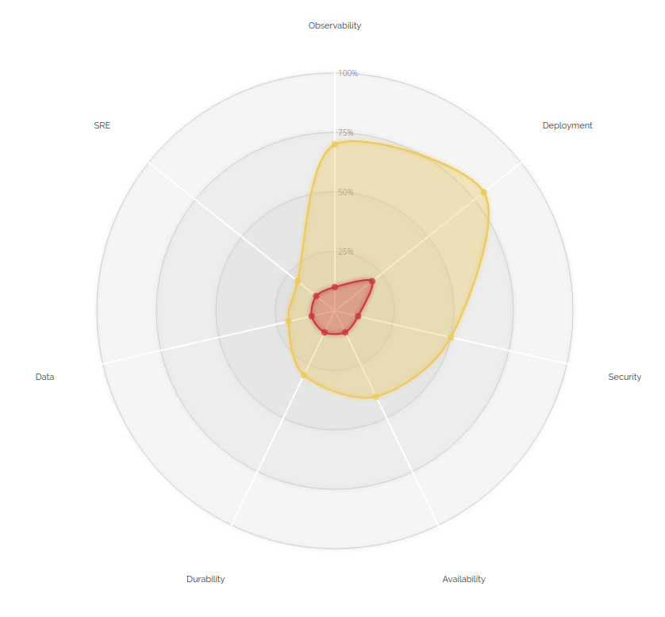

# DevSecOps Capability Model
A simplified capability model for those on DevSecOps transformation journey.
Fork and use this to map where you as an organisation are and where you need to be.



All the raw data is in `data/tableData.json`

Deployed using github-pages to [](https://devsecops.jujhar.com)

Fork this radar and modify `data/tableData.json` to rate your own teams/organisation.

## Inspired by

Influenced and inspired by
- [Unicorn Project](https://www.amazon.co.uk/dp/1942788762)
- [Accelerate](https://www.amazon.co.uk/dp/1942788339)

Thanks to [Timo Pagel](https://github.com/wurstbrot) for the initial [project](https://github.com/wurstbrot/DevSecOps-MaturityModel).

## Deploying

This site is a [Jekyll static site](https://jekyllrb.com/) and will be auto deployed via Github pages to [https://devsecops.jujhar.com]() upon commit to master

## Local Development

```bash
# to server on localhost:4000 and continuously transpile output
docker run -it --rm \
  -v ${PWD}:/srv/jekyll \
  -p 4000:4000 \
  jekyll/jekyll \
  jekyll serve --watch

# OPTIONAL use the awesome `reload` which auto-refreshes your browser on change using websockets
# `npm install -g reload`
(cd _site && reload -e "html|js|css|json")

# If you're not publishing to github pages use this command to one time build assets into _site and then publish to a S3 static bucket or old school server
# NB you don't need to do this to publish via github pages - Github does it automatically on commit
docker run --rm -v \
  ${PWD}:/srv/jekyll \
  jekyll/jekyll \
  jekyll build
```
